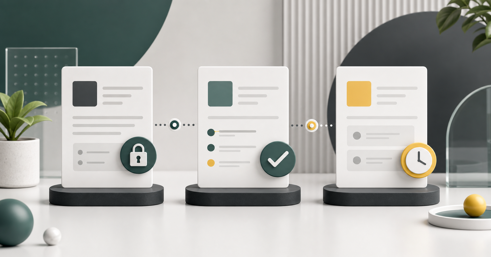
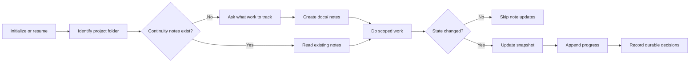

# Agent Continuity

Privacy-first continuity notes for long-running AI coding sessions.



Agent Continuity is a small agent skill for projects that span more than one session. It gives an AI coding agent a lightweight way to initialize, resume, and close out work from project-local notes without turning those notes into a private memory dump.

The goal is simple: keep enough state to continue the work, and nothing more.

## Why This Exists

Long-running agent work usually fails in one of two ways:

- The next session has no context and repeats discovery work.
- The project grows a "memory" folder full of private paths, raw logs, chat fragments, and stale personal notes.

Agent Continuity uses four short files instead:

- `docs/START_HERE.md` for the stable entry point
- `docs/CURRENT_STATE.md` for the current snapshot
- `docs/PROGRESS.md` for append-only work chunks
- `docs/DECISIONS.md` for durable project decisions

## What It Creates

When starting a new long-running project, the skill asks what work should be tracked and creates a compact `docs/` continuity set:

```text
docs/
  START_HERE.md
  CURRENT_STATE.md
  PROGRESS.md
  DECISIONS.md
```

## Install

Copy the skill folder into your Codex skills directory.

```powershell
Copy-Item -Recurse .\skills\agent-continuity "$env:USERPROFILE\.codex\skills\agent-continuity"
```

On macOS or Linux:

```bash
cp -R ./skills/agent-continuity ~/.codex/skills/agent-continuity
```

## Quick Start

Set up continuity notes for a project:

```text
Use $agent-continuity to set up continuity notes for this project.
```

Resume existing work:

```text
Use $agent-continuity to resume this project.
```

Close out a session:

```text
Use $agent-continuity to close out this session and leave the next actions clear.
```

## Workflow



## Privacy Model

Continuity notes are project state, not personal memory.

Store:

- current goal
- current implementation state
- files or areas being changed
- known blockers
- next actions
- durable decisions and why they matter

Do not store:

- API keys, tokens, passwords, private keys, or credentials
- `.env` values
- private URLs or internal dashboards
- client names, user records, customer data, or personal identifiers
- absolute local home paths
- raw chat transcripts
- raw logs that may contain secrets
- unreleased business metrics or private project history

See [docs/privacy-model.md](docs/privacy-model.md) for the full model.

## Repository Layout

```text
skills/agent-continuity/
  SKILL.md
  agents/openai.yaml
  references/state-notes.md
examples/safe-project/docs/
docs/privacy-model.md
docs/comparison.md
scripts/privacy-scan.py
```

The installable skill stays small. Public documentation, examples, and validation scripts live at the repository level.

For positioning against other approaches, see [docs/comparison.md](docs/comparison.md).

## Privacy Scan

Run the scanner before publishing or tagging a release.

```bash
python scripts/privacy-scan.py .
```

Add project-specific terms when preparing a public release from a private workspace. Use environment variables so the example command does not add the private terms to the repository itself.

```bash
python scripts/privacy-scan.py . --term "$PRIVATE_PROJECT_TERM" --term "$PRIVATE_CLIENT_TERM"
```

On PowerShell:

```powershell
python scripts/privacy-scan.py . --term $env:PRIVATE_PROJECT_TERM --term $env:PRIVATE_CLIENT_TERM
```

## License

MIT
